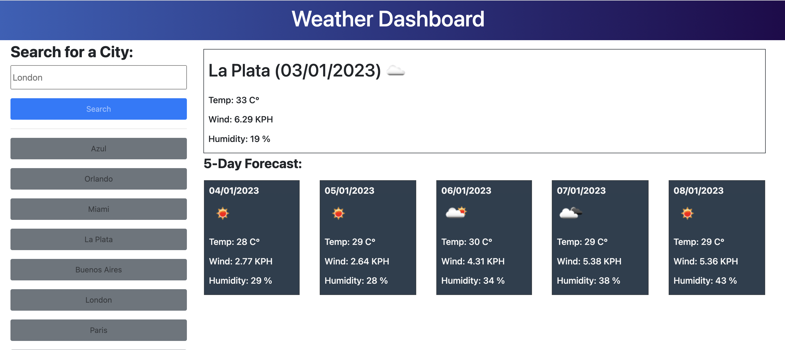

# Weather-Forecast

## Description

Application for the weather forecast of a city. 

This app will run in the browser, and will feature dynamically updated HTML and CSS powered by Jquery code. Will also use Use openweathermap API(https://openweathermap.org/) to retrieve weather data for cities.

## Sreenshoot

## Installation

N/A 

## Usage

When a user searches for a city they are presented with current and future conditions for that city. 

The searched city will also be added to the search history. Click on any of the history button to search for the same city again.

## Credits

1. https://openweathermap.org/api/ - fast and easy-to-work weather APIs.
2. https://momentjs.com/ -Parse, validate, manipulate,and display dates and times in JavaScript.
3. https://cssgradient.io/ - CSS Gradient is a happy little website and free tool that lets you create a gradient background for websites.

## License

The MIT License (MIT)

Copyright (c) 2022 Sabrina Martorelli

Permission is hereby granted, free of charge, to any person obtaining a copy of this software and associated documentation files (the "Software"), to deal in the Software without restriction, including without limitation the rights to use, copy, modify, merge, publish, distribute, sublicense, and/or sell copies of the Software, and to permit persons to whom the Software is furnished to do so, subject to the following conditions:

The above copyright notice and this permission notice shall be included in all copies or substantial portions of the Software.

THE SOFTWARE IS PROVIDED "AS IS", WITHOUT WARRANTY OF ANY KIND, EXPRESS OR IMPLIED, INCLUDING BUT NOT LIMITED TO THE WARRANTIES OF MERCHANTABILITY, FITNESS FOR A PARTICULAR PURPOSE AND NONINFRINGEMENT. IN NO EVENT SHALL THE AUTHORS OR COPYRIGHT HOLDERS BE LIABLE FOR ANY CLAIM, DAMAGES OR OTHER LIABILITY, WHETHER IN AN ACTION OF CONTRACT, TORT OR OTHERWISE, ARISING FROM, OUT OF OR IN CONNECTION WITH THE SOFTWARE OR THE USE OR OTHER DEALINGS IN THE SOFTWARE.

## Deployment link

https://sabrina-martorelli.github.io/Weather-Forecast/
